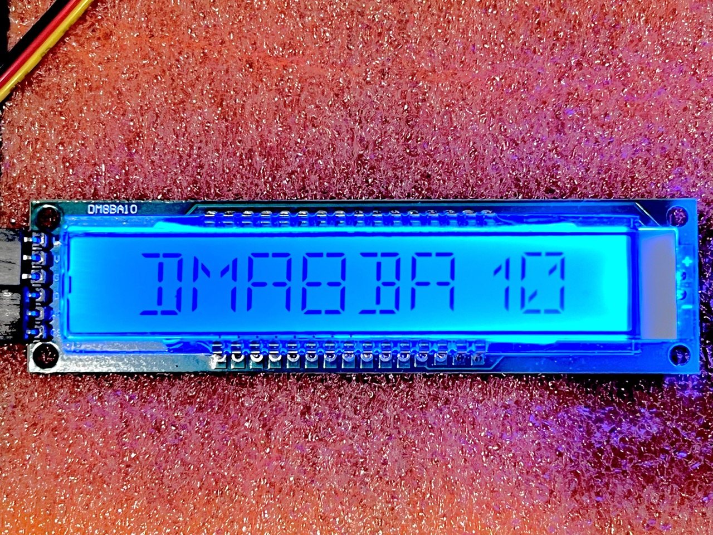
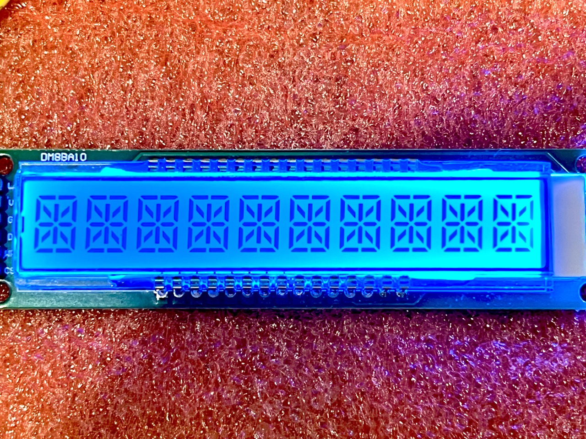
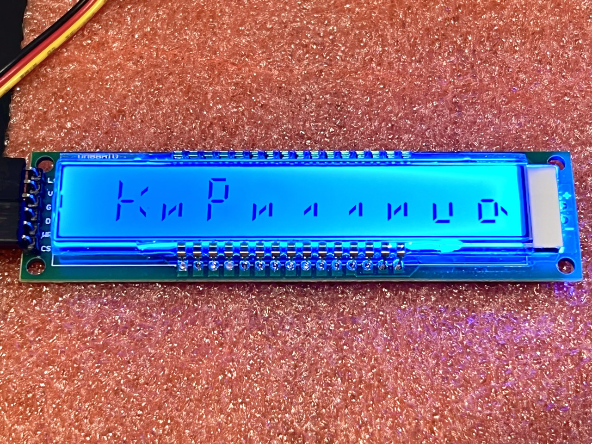
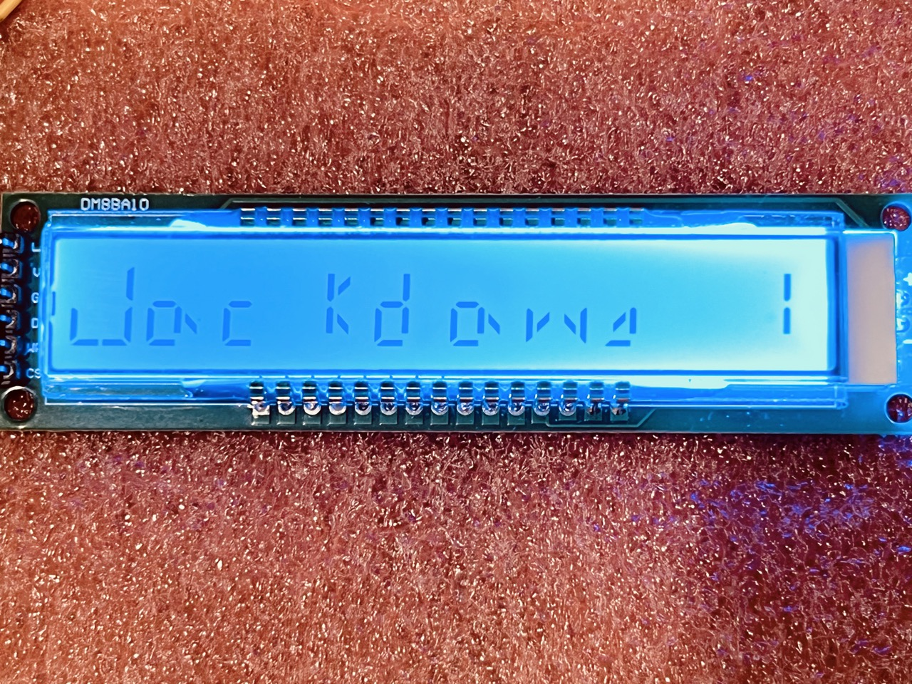
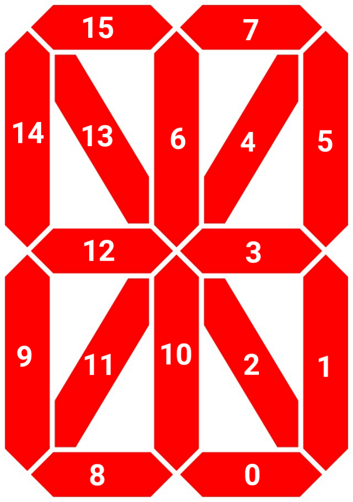
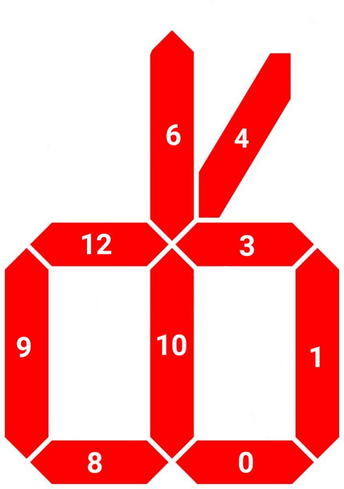

# DM8BA10 16-segment LCD Arduino library

## Description
Arduino library for chinese 16 segment/10 characters LCD modules based on HT1622 driver.



## Features
- Displaying any kind of characters
- Automatic alignment of strings
- Text scrolling capability 
- Custom character sets support





## Installation

You can install the library via Arduino IDE library manager or
[download latest release](https://github.com/road-t/DM8BA10/releases)
and unzip it to your project folder.

## Usage

1. Connect the display `CS`, `WR` and `DATA` wires to any three Arduino's digital pins (backlight should be connected
to analog pin or to +5V if you don't wan't to control it programmatically).

2. Include the library header:
```c++
#include <DM8BA10.h>
```
3. Include preferable charset instance:
```c++
#include <charset/latin_basic.h>
```
4. Create charset:
```c++
auto charset = new LatinBasicCharset();
```
5. Create `DM8BA10` instance:
```c++
auto lcd = new DM8BA10(charset);
```
6. Display something:
```c++
lcd->println("PROFIT");
```

## API reference
### Constructor
```c++
DM8BA10(Charset* charset, byte csPin, byte wrPin, byte dataPin, int16_t backlightPin = -1)
```
#### Description
Creates new DM8BA10 object

#### Parameters
- `charset` – a pointer to Charset object
- `csPin` – pin, connected to CS pin of the display
- `wrPin` – pin, connected to WR pin of the display
- `dataPin` – pin, connected to DATA pin of the display
- `backlightPin` – pin, connected to LCD's backlight pin

#### Example
```c++
#define CS_PIN        9 // SS
#define WR_PIN        8 // SCK
#define DATA_PIN      7 // MOSI
#define BACKLIGHT_PIN A3 // set to 0 if backlight isn't available

DM8BA10* lcd;

void setup()
{
    lcd = new DM8BA10(new CyrillicSlavicCharset(), CS_PIN, WR_PIN, DATA_PIN, BACKLIGHT_PIN);
}
```
### println
```c++
void println(String& str, Padding podType = Right)
```
#### Description
Fills all places on display and resets current position.
*This function is slower than print() and consumes extra memory.*
#### Parameters
- `str` – input string (non-ASCII characters should be prepared via `Charset::remap` function of the chose charset)
- `padding` – The alignment of strings shorter than display capacity: `Right` `Left`, `Both` (center).
#### Example
```c++
auto text = "Пример"; // 'example'
auto preparedText = lcd->getCharset()->remap(text);

lcd->println(preparedText, DM8BA10::Padding::Both);
```
### print
```c++
byte print(String& str, int8_t pos = -1)
```
#### Description
Prints the text starting from specified or current position (by default)
to the end of the string or the indicator.

**N.B.** It doesn't overwrite places outside of specified string and can
cause artifacts. Current position will be reset if the display is full.
#### Parameters
- `str` – input string (non-ASCII characters should be prepared via `Charset::remap` function of the chose charset)
- `pos` – starting position at the display or `-1` to use current position
### scroll
```c++
void scroll(String& text, word start = 0)
```
#### Description
Prints string starting at `start` and adds a space to the end of string.
Can be used to scroll text on the display.
#### Parameters
- `text` – input string (non-ASCII characters should be prepared via `Charset::remap` function of the chose charset)
- `start` – staring position of the text to print. Should be incremented before call.
#### Example
```c++
void loop()
{
  auto text = "Lorem ipsum dolor sit amet";

  static word strPos =  0;
  static uint32_t lastUpd = 0;

  auto nowMs = millis();

  if (nowMs - lastUpd > 300)
  {
      lcd->scroll(text, strPos++);
  
      if (strPos >= text.length())
          strPos = 0;
  
    lastUpd = nowMs;
  }
}
```
### drawChar
```c++
void drawChar(word ch, byte pos)
```
#### Description
Draws anything by filling segments, specified by bits in ch parameter at pos
#### Parameters
- `ch` – 16-bit encoded symbol
- `pos` - position of the symbol at the display
#### Example
```c++
// let's draw 'T' letter in the middle of the screen
lcd->drawChar(0x84C0, 4);
```
### setChar
```c++
void setChar(const byte value, int8_t pos = -1)
```
#### Description
Displays specified character at specified position (or at current position if
`pos` == -1). Doesn't affect the current position.
#### Parameters
- `value` – 1-byte character. For non-ASCII characters use
Charset::remap() function to get the correct value for used charset.  
- `pos` – position of the symbol at the display
### point
```c++
void point(byte index, bool on = true)
```
#### Description
Switch on or off decimal point at specified position.

**N.B.** 9 decimal points aren't part of common symbols, so they should be
controlled separately.
#### Parameters
- `index` – index of the point from 0 to 8 (left to right)
- `on` – state `true` – on, `false` - off
### setPoint
```c++
void setPoint(byte index)
```
#### Description
Turns on decimal point at specified position, switching off all other.
#### Parameters
- `index` – index of the point from 0 to 8 (left to right)
### resetPoints
```c++
void resetPoints()
```
#### Description
Turns off all the decimal points.
### allSegments
```c++
void allSegments(bool on = true)
```
#### Description
Turns on or off all the segments of every symbol.
### clearDisplay
```c++
void clearDisplay()
```
#### Description
Turns all the segments off and reset current position.

### setPos
```c++
byte setPos(int8_t)
```
#### Description
Sets current position
#### Parameters
- `0..9` – symbol from left to right
- `-1` – most right place
### padString
```c++
String padString(String& text, Padding padType)
```
#### Description
Returns string padded with spaces to fill all the places on the display.
#### Parameters
- `text` – input String. Should be prepared with `Charset::remap()` function
to avoid erroneous length detection.
- padType – padding type: `Right` `Left`, `Both`
### getCharset
```c++
Charset* getCharset()
```
#### Description
Returns current `Charset` object to access its properties or methods.
### LCD
```c++
void LCD(bool on = true)
```
#### Description
Turns or and off LCD.
### backlight
```c++
void backlight(bool on = true)
```
#### Description
Turns on or off backlight.
### systemOscillator
```c++
void systemOscillator(bool on = true)
```
#### Description
Turns or and off HT-1622 built-in oscillator.

## Charsets
Charset-derived classes used to provide font for 16-segment indicators and
auxiallry functions. You can use one of provided Charsets or create your own.

### Usage
Just create new `Charset` children class instance and pass it to DM8BA10 driver.
For non-serial mapped and/or non-ASCII characters you should call `remap()` function
to clean-up UTF-8 extra bytes and map your symbols to match the font:
```c++
auto charset = new CyrillicMinCharset();
auto lcd = new DM8BA10(charset);

auto text = "Строка UTF-8"; // 'UTF-8 string'

auto preparedText = charset->remap(text);

lcd->println(preparedText);
```

### Create charset
To create your own charset you need to derive from `Charset` class and implement
at two functions:

– `word Char(word index)` – should return 16-bit encoded symbol by its index or some special
character if the index is out of bounds
– `word size()` – should return your character table size

### Customize charset
Firstly, you have to create your own font. To control every segment you have to use
corresponding bits of big-endian 2-byte word:



The segments numbering starts from major (rightmost bit).

For instance, if we want to draw a scissor-like character:



We have to encode particular segments by setting corresponding bits:

`0001011101011011b` – this equals `0x175B` in hexadecimal. 

Thus, you can create any font for any character set you like.  

Also, we can specify dummy character for symbols, that are absent from your font:
`word dummy()` – return bits for dummy character

First symbol in font usually is the space character with standard code `0x20`,
but you can change starting font offset to any other you need by reimplementing
`startingOffset()` function.

### Mapping UTF-8 and other characters
ASCII characters are 1-byte wide, but if you need to use wider (e.g. UTF-8) symbols,
you'll have to implement `remap` function. Let's have a look to its implementation for
cyrillic charset:

```c++
String& remap(String& string) override
{ 
  word curLen = 0;
  byte prefix = 0;

  // we iterate over the string
  for (word i = 0; i < string.length(); i++)
  {
    byte ch = string[i];

    // for cyrillic we can have one of these UTF-8 preambles
    if (ch == 0xD0 || ch == 0xD1 || ch == 0xC3)
    {
      prefix = ch;
      continue;
    }

    // when we find the character per se, let's check
    // whether it needs to be remapped to other position
    
    // fix for macOS uppercase 'double umlaut E' – Ë
    if (prefix == 0xC3 && ch == 0x8B)
    {
      ch = 0x81;
    }
    else if (prefix == 0xD1)
    {
       // there's a weird gap between п (0xD0BF) and р (0xD180)
      ch += 0x40;
    }
     
    prefix = 0;

    string[curLen++] = ch;
  }

  string = string.substring(0, curLen);

  return string; 
}
```

That's all, folks! ©

Feel free to fork, make pull requests and contact me)

*Ilya 'road-t' Annikov &copy; 2022*